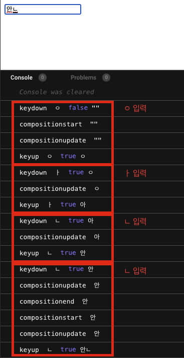
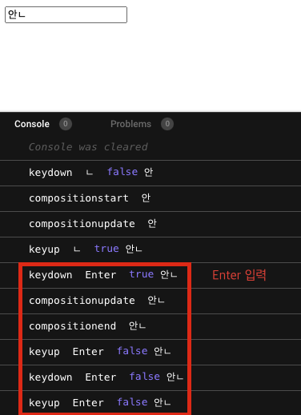
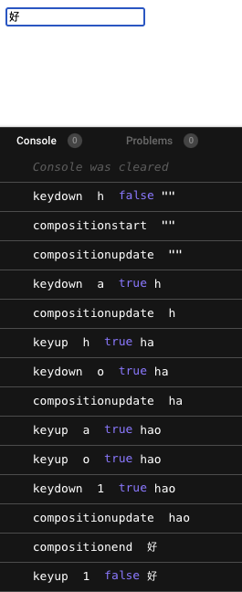

한글을 입력하고 엔터를 입력하는 기능을 추가했는데 크롬에서 제일 마지막의 문자 한글자가 중복되어 쓰이는 문제가 발생했다. 영어를 쓸 때는 그런 문제가 없었다.

### IME

IME는 Input Method Editor로 CJKT(Chinese, Japanese, Korean, Taiwan)를 입력하는데 사용한다. 키보드에 있는 문자로 모든 입력을 할 수 있는 영어와는 달리 CJKT는 문자의 숫자가 수천개가 넘고 이를 키보드에서 직접 입력할 수 없기 때문이다. 모바일에서도 IME가 사용되기도 한다.

### [Key Events During Composition](https://w3c.github.io/uievents/#events-composition-key-events)

이 IME에서 입력시 composition 이벤트가 발생하게 되는데 실제 input에서 입력할 때 글자 하단에 검은 밑줄이 보이는 부분이 composition 중인 문자라는 것을 의미한다. `KeyboardEvent.isComposing` 값으로 composition 중인지 여부를 알 수 있다.

  
input 창에 안ㄴ 을 쳐보았다.

처음 ㅇ을 입력할 때 `keydown-compositionstart-compositionupdate-keyup` 이벤트가 일어난다. 그 다음 ㅏ와 ㄴ을 입력하면 `keydown-compositionupdate-keyup` 이벤트가 일어난다. composition이 일어나고 있는 중이기 때문에 compositionstart가 아닌 compositionupdate 이벤트가 일어났다. 마지막으로 다시 ㄴ을 입력했을 때는 `keydown-compositionupdate-compositionend-compositionstart-compositionupdate-keyup` 순으로 이벤트가 발생하는데 앞서 입력한 ㅇ-ㅏ-ㄴ이 하나의 글자를 완성하며 해당 문자의 composition이 끝났기 때문에 compositionend 이벤트가 발생했다. 그리고 새로운 문자의 compsition을 시작하기 위해 compositionstart가 다시 발생했다.

이 때 isComposiing 이벤트 값은 처음의 keydown 이벤트를 제외하고는 모두 true이다. compositionend 이벤트가 발생했더라도 말이다.




여기서 Enter 키를 쳐보면 `keydown-compositionupdate-compositionend-keyup-keydown-keyup` 순으로 이벤트가 발생하는데 드디어 isComposing이 false로 리턴되는 것을 볼 수 있다. 하지만 keydown-keyup 이벤트가 다시 한 번 발생하게 되는데 이 것 때문에 Enter 키를 쳤을 때 문자 한 글자가 중복되는 문제가 발생했던 것이다. 한글과 마찬가지로 IME를 사용해 입력하는 중국어로 테스트를 해봐도 hao 입력 후 문자를 선택해도 `keydown-compositionupdate-compositionend-keyup` 이벤트로 끝이 나는데 한글에서만 keydown-keyup이 두 번 발생한다. 🤔 [크롬 브라우저의 이슈](https://github.com/vuejs/vue/issues/10277#issuecomment-731768059)로 현재는 보고 있는 것 같다.

### 한 번만 Enter keydown 이벤트 인식하기

```jsx
input.addEventListener("keydown", (e) => {
  const value = e.target.value;
  if (e.key === "Enter" && !e.isComposing) {
    console.log("Enter pressed", value, e);
  }
});
```

크롬에서 한글 입력 후 entery keydown 이벤트를 한 번만 인식하기 위해서는 compositino이 끝난 단계에서 한 번만 감지될 수 있도록 e.isComposing이 false일 때 원하는 동작을 실행시키면 되겠다.

---

[https://developer.mozilla.org/en-US/docs/Glossary/Input_method_editor](https://developer.mozilla.org/en-US/docs/Glossary/Input_method_editor)
[https://developer.mozilla.org/en-US/docs/Web/API/Element/compositionstart_event](https://developer.mozilla.org/en-US/docs/Web/API/Element/compositionstart_event)
