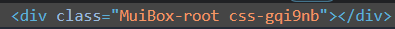
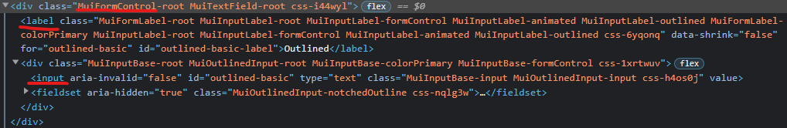

## 1. MUI란?

> 구글의 디자인 철학인 Material Design을 구현한 리액트 컴포넌트 라이브러리

2014년에 개발이 시작 되었고 2018년에 v1이 릴리즈되었다. 2022년 11월 현재 버전은 v5.10.14까지 나왔다.

### 설치

```jsx
yarn add @mui/material @emotion/react @emotion/styled
```

### 버전 5

**변경점**

많은 변경점이 있었던 v5 버전은 2021년 9월에 릴리즈 되었다. 이 때 기존에 사용하던 명칭을 material ui에서 mui로 변경했고 네이밍이나 로고뿐만 아니라 브랜드 아이덴티티를 전체적으로 변경하며 기존의 material ui와 차이를 명확히 하는 뱡항으로 변화했다.

**기본 스타일링 엔진 변경**

emotion이 MUI의 기본 스타일링 엔진으로 변경되었다. [v4로 박스를 만들던 때보다 속도가 5~10배 정도 빨라졌다고 한다.](https://codesandbox.io/s/zlh5w?file=/src/App.js)

기존에 주로 사용되던 JSS 기반의 [@mui/styles](https://mui.com/system/styles/basics/#hook-api)는 v5에서는 레거시 스타일링 방법이 되었다.

```jsx
// v4의 @mui/styles 기반 스타일링
import * as React from "react";
import { makeStyles } from "@mui/styles";
import Button from "@mui/material/Button";

const useStyles = makeStyles({
  root: {
    background: "linear-gradient(45deg, #FE6B8B 30%, #FF8E53 90%)",
    border: 0,
    borderRadius: 3,
    boxShadow: "0 3px 5px 2px rgba(255, 105, 135, .3)",
    color: "white",
    height: 48,
    padding: "0 30px",
  },
});

export default function Hook() {
  const classes = useStyles();
  return <Button className={classes.root}>Hook</Button>;
}
```

**스타일링 엔진을 jss에서 emotion으로 변경한 이유**

1. 리액트 커뮤니티에서 `styled()` 가 css-in-js api의 가장 인기 있는 api로 자리 잡았다. (The React community is settling on `styled()` as the **most popular** CSS-in-JS API. ) `makeStyles` 와 같은 api는 개발자들에게 여전히 새롭게 느껴졌다.
2. JSS 방식의 스타일링이 정적 css 생성에서는 빨랐지만 동적 스타일 생성에서는 너무 느렸다.

**SX 속성의 추가**

sx 속성은 css의 슈퍼셋으로 css 속성은 물론이고, 단축 속성이나 미디어 쿼리를 사용할 수 있고 커스텀한 theme에 쉽게 접근도 가능하다. 따라서 css에 익숙하다면 비교적 쉽게 sx 속성에 적응할 수 있다.

기존에 styled api로 개발을 했을 때에는 컴포넌트의 스타일을 선언하는 부분과 해당 컴포넌트를 사용하는 부분이 나뉘어 있어 컨텍스트 스위칭으로 시간을 낭비했다. 또한, 모든 컴포넌트들이 독립적으로 구성되며 네이밍이 필요했고 이 또한 리소스가 필요한 작업이었다.

뒤에서 좀 더 자세하게 sx 속성의 사용법에 대해 알아보겠다.

### MUI 프로젝트


- `@mui/material` material design 기반의 컴포넌트들의 모음으로 가장 많이 사용될 패키지이다.
- `@mui/base` 스타일링이 되지 않은 UI 컴포넌트와 훅으로 기존 MUI 스타일에 종속되지 않고 스타일을 제어할 수 있다.
- `@mui/system` css 유틸리티 모음으로, `@mui/material` 에 이미 포함되어 있기 때문에 따로 설치할 필요가 없다.
- `@mui/styled-engine` emotion으로 구현된 스타일링 엔진이다. 기본 엔진이기 때문에 스타일링 엔진을 emotion으로 가져간다면 따로 설치할 필요가 없다.
- `@mui/styled-engine-sc` styled-components로 구현된 스타일링 엔진이다.
- `@mui/styles` JSS 기반의 스타일링 방식으로 v5에서부터 legacy가 되었다.

### MUI의 장점

처음 프로젝트의 기술 스택을 선정할 때 어떤 스타일링 방식을 선택할지 고민이 많았다. MUI를 프로덕션 레벨에서 사용해본 적이 없었고 또 처음 접했을 때 문서도 너무 방대해보였을 뿐만 아니라 MUI 내에서도 세부적인 스타일링 방식이 너무 다양하게 느껴졌기 때문에 거리감이 느껴졌었다. 하지만 잘만 활용한다면 아주 디테일한 스타일링이 많지 않은 b2b 프로젝트의 특성상 빠른 생산성을 가져갈 수 있을거라 판단했고 한두달 정도 사용해본 결과 해당 서비스에 결이 잘 맞는 기술 스택이었던 것 같다.

**리액트 커뮤니티 내에서의 높은 지분율**

리액트 커뮤니티에서 MUI가 많은 지분을 차지하고 있는 만큼 관련 자료를 찾기가 쉽다.

**공통 theme 설정 및 적용**

theme 설정 하나로 MUI에서 제공되는 모든 컴포넌트들에 공통된 색상과 글꼴, 여백들을 부여할 수 있다. 간단하다!

**일관된 컴포넌트**

컴포넌트만을 관리하는 개발자는 없지만 최대한 공통으로 사용되는 컴포넌트들은 일관되게 사용할 수 있도록 하고 싶었다. MUI에서 제공해주는 컴포넌트를 바탕으로 원하는 속성만 추가로 extends 시켜 개발하니 어느 정도 일관성이 유지되는 것 같다.

## 2. 사용법

### [sx 속성](https://mui.com/system/getting-started/the-sx-prop/#basic-example)

sx 속성은 v5에 새롭게 추가된 기능으로 기존의 주 스타일링 방식이었던 `makeStyles`에서 벗어나 주 스타일링 방식이 되었다.

**css의 수퍼셋**

기존에 리액트에서 style 속성으로 스타일링을 하는 것처럼 카멜 케이스 형식으로 스타일링을 적용한다. `&:hover` 와 같이 가상 선택자의 스타일링도 가능하다.

또한, padding이나 margin과 같이 단축 속성이 지원되는 css 속성들도 있어 더 짧게 사용할 수 있다.

```jsx
import * as React from 'react';
import Box from '@mui/material/Box';

export default function BoxSx() {
  return (
    <Box
      sx={{
        width: 300,
        height: 300,
        backgroundColor: 'primary.dark',
        '&:hover': {
          backgroundColor: 'primary.main',
          opacity: [0.9, 0.8, 0.7],
        },
				// 단축 속성
				m={1}
				p={2}
      }}
    />
  );
}
```

**theme-aware properties**

theme을 정의해놓으면 sx 속성에서 원하는 theme의 값을 불러와 사용할 수 있다.

아래 예제는 `createTheme` 을 이용해 색상 theme인 palette를 지정했다. palette 내부에 정의된 object들을 따라가며 점(.)으로 원하는 값에 접근하면 된다. ex) `background.paper`

색상 외에도 typography, spacing, breakpoints, zIndex, transitions, components들의 theme을 설정하고 해당 값 또한 점(.) 으로 접근 가능하다.

```jsx
import * as React from "react";
import { Box, ThemeProvider, createTheme } from "@mui/system";

const theme = createTheme({
  palette: {
    background: {
      paper: "#fff",
    },
    text: {
      primary: "#173A5E",
      secondary: "#46505A",
    },
  },
});

export default function Example() {
  return (
    <ThemeProvider theme={theme}>
      <Box
        sx={{
          bgcolor: "background.paper",
          boxShadow: 1,
          borderRadius: 2,
          p: 2,
          minWidth: 300,
        }}
      >
        <Box sx={{ color: "text.secondary" }}>Sessions</Box>
        <Box sx={{ color: "text.primary", fontSize: 34, fontWeight: "medium" }}>
          98.3 K
        </Box>
      </Box>
    </ThemeProvider>
  );
}
```

**[반응형 대응](https://mui.com/system/getting-started/usage/#responsive-values)**

특히 많이 편리하다고 느낀 점이 바로 반응형 대응이다. 사실 파트너스에서는 반응형 대응을 할 일이 크게 없긴 하지만 미디어 쿼리를 사용하지 않고 object 하나로 대응을 하는게 참 편리하다고 느껴졌다.

사용법은 반응형 사이즈별 값이 정의된 object를 sx 속성에 넘겨주어도 되고, 스타일 속성에 직접 적어주는 방법도 가능하다.

```jsx
import * as React from "react";
import Box from "@mui/material/Box";

export default function BreakpointsAsObject() {
  return (
    <div>
      <Box
        sx={{
          width: {
            sm: 200, // theme.breakpoints.up('sm')
            md: 300, // theme.breakpoints.up('md')
          },
        }}
      >
        This box has a responsive width.
      </Box>
      <Typography
        fontSize={{
          xs: 13,
          md: 18,
        }}
      >
        Typography
      </Typography>
    </div>
  );
}
```

**callback values**

sx 속성 안에 존재하는 각각의 스타일 속성들은 콜백 함수를 받아 theme에 접근이 가능하다.

```jsx
<Box sx={{ height: (theme) => theme.spacing(10) }} />
```

### 디테일하게 스타일링하기

MUI가 워낙 잘 만들어진 컴포넌트라고는 하지만 각각의 프로젝트의 디자인 테마에 맞는 스타일링은 필요하다.

**전체 컴포넌트에 변경사항 적용하기**

theme 중에 `components` 라는 속성이 있는데 여기에서 MUI 컴포넌트들의 속성을 공통으로 제어할 수 있다.

```jsx
const theme = createTheme({
  components: {
    // Name of the component
    MuiButtonBase: {
      defaultProps: {
        // The props to change the default for.
        disableRipple: true, // No more ripple, on the whole application 💣!
      },
    },
  },
});
```

**부분적으로 스타일 변경하기**

MUI로 개발된 html을 보면 무엇인지 모를 클래스명들이 매우 많이 들어가 있는 것을 확인할 수 있다. 처음에는 낯설게 느껴질 수 있지만 클래스명들을 읽어보다 보면 어떤 MUI 컴포넌트로 생성된 element인지 잘 알 수 있게끔 클래스명이 명확하게 구성되어 있는 것을 확인할 수 있다.

  
이 사진은 Box 컴포넌트가 html로 구성된 것인데 `MuiBox-root` 라는 클래스명이 생성 되었다. 이렇게 생성된 클래스명으로 좀 더 디테일한 스타일링을 할 수 있다. sx 속성에서는 css 선택자를 사용할 수 있고 따라서 하위 element의 클래스명에 접근하면 웬만한 스타일링은 가능하다.

```jsx
<TextField
  sx={(theme) => ({
    borderRadius: "8px",
    ".MuiInputBase-root": {
      paddingLeft: "16px",
      "&.Mui-focused fieldset": {
        borderColor: "primary.main",
        borderWidth: "1.5px",
      },
    },
  })}
/>
```

**css 코드 사용하기**

카멜 케이스 형식으로 작성하는 css가 불편하다면 `emotion`의 `css` 속성을 사용하면 된다.

```jsx
import { css } from "@emotion/react";

export default function EmotionCSS() {
  return (
    <Slider
      defaultValue={30}
      css={css`
        color: #20b2aa;
        :hover {
          color: #2e8b57;
        }
      `}
    />
  );
}
```

## 3. 주요 컴포넌트

### LayoutComponent

**Box**

가장 자주 사용될 wrapper 컴포넌트이다.

component라는 속성을 통해 원하는 DOM element를 넘겨주면 해당되는 element를 생성해준다.

```jsx
function BoxComponent() {
  return (
    <Box component="span" sx={{ p: 2, border: "1px dashed grey" }}>
      <Button>Save</Button>
    </Box>
  );
}
```

**Stack**

자식 요소들을 수직이나 수평으로 관리하고 각 자식 요소마다 spacing이나 divider 설정을 할 수 있는 컴포넌트이다. `div` 에 `display:flex` 속성을 주었다고 생각하면 쉬울 것 같다. 기본 방향은 `column`이다.

```jsx
<Stack spacing={2}>
  <Item>Item 1</Item>
  <Item>Item 2</Item>
  <Item>Item 3</Item>
</Stack>
```

**Container**

기본적인 레이아웃 요소이고, content를 수평 중앙에 배치해준다.

**Grid**

반응형 레이아웃에 유용한 컴포넌트이다. 12개의 컬럼이 그리드 레이아웃의 기본이다.

```jsx
<Grid container spacing={2}>
  <Grid item xs={8}>
    <Item>xs=8</Item>
  </Grid>
  <Grid item xs={4}>
    <Item>xs=4</Item>
  </Grid>
  <Grid item xs={4}>
    <Item>xs=4</Item>
  </Grid>
  <Grid item xs={8}>
    <Item>xs=8</Item>
  </Grid>
</Grid>
```

### TextField

label, input, help text로 구성된 wrapper component이다. element를 보면 역시 여러 개로 구성되어 있다.



**기본 속성**

required, disabled, type과 같은 html input 태그의 속성들도 전달할 수 있지만, TextField에서는 가장 많이 쓰이는 속성만 적용이 되어 있기 때문에 모든 속성이 동작하는 것은 아니다. 이 외에도 error나 helperText도 전달이 가능해 validation 결과를 비교적 쉽게 보여줄 수 있다.

**multiline**

multiline 속성을 넘겨주면 input 태그에서 textarea 태그로 변한다.

### 실제 사용

- 신규 프로젝트에서의 사용 사례
- 타입 스크립트 대응

---

**참고 자료**

[https://mui.com/blog/mui-core-v5/](https://mui.com/blog/mui-core-v5/)

[https://codesandbox.io/s/zlh5w?file=/src/App.js](https://codesandbox.io/s/zlh5w?file=/src/App.js)

[https://mui.com/system/styles/basics/#hook-api](https://mui.com/system/styles/basics/#hook-api)

[https://mui.com/system/getting-started/usage/#responsive-values](https://mui.com/system/getting-started/usage/#responsive-values)

[https://mui.com/system/getting-started/the-sx-prop/#basic-example](https://mui.com/system/getting-started/the-sx-prop/#basic-example)
