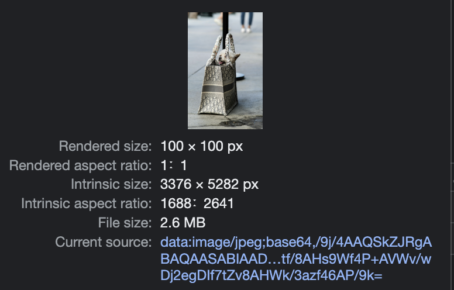

이미지를 크롭해 파일로 만드는 기능을 구현하던 중 파일의 사이즈가 원본 이미지 파일보다 더 커지는 현상이 발생했다. 원인을 찾아보니 파일의 사이즈는 작은데 이미지의 너비와 높이가 3000픽셀이 넘어가는 파일들이 존재했고 그런 파일들을 크롭한 후 파일로 만들 때 원본 이미지의 너비, 높이가 크다보니 canvas로 이미지를 그려 크롭을 하고 난 후에도 이미지의 너비, 높이가 크고 거기서 만들어진 파일의 크기도 커지는 문제였다.

첫 번째로, 크롭 라이브러리로 react-easy-crop을 사용했는데 크롭하고자 하는 크기의 비율만큼 크롭된 결과물의 크기를 줄였다.

두 번째로, canvas에 이미지를 그릴 때 좌표와 함께 조정된 사이즈의 이미지 너비, 높이를 함께 전달해준다.

```jsx
const canvas = document.createElement('canvas');
const ctx = canvas.getContext('2d');
const image = new Image(100, 100);
image.src = 'image.png';

// 1)
ctx.drawImage(image, 0, 0);
// 2)
ctx.drawImage(image, 0, 0, image width, image height);
```

처음에는 이미지 엘리먼트를 생성할 때 크기를 지정해주었기 때문에 캔버스에 이미지를 그릴 때 따로 이미지의 크기를 지정해주지 않아도 이미지가 모두 캔버스 안에 그려질 것이라고 생각했다. 하지만 이때 그려지는 이미지는 이미지의 원본 사이즈(intrinsic size)를 기준으로 그려졌고 2번과 같이 캔버스에 그려질 이미지 사이즈를 직접 정의해줘야 이미지가 잘리지 않고 캔버스에 그려진다.



이미지 엘리먼트를 생성할 때 설정하는 width, height는 `rendered size`이고 `intrinsic size`는 이미지의 원본 사이즈이다. 이 `intrinsic size`는 `HTMLImageElement.naturalWidth,` `HTMLImageElement.naturalHeight`로 접근이 가능하다.

---

[https://developer.mozilla.org/en-US/docs/Web/API/HTMLImageElement/Image](https://developer.mozilla.org/en-US/docs/Web/API/HTMLImageElement/Image)

[https://developer.mozilla.org/en-US/docs/Web/API/HTMLImageElement/naturalWidth](https://developer.mozilla.org/en-US/docs/Web/API/HTMLImageElement/naturalWidth)

---
